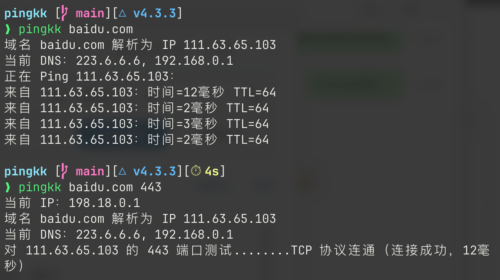
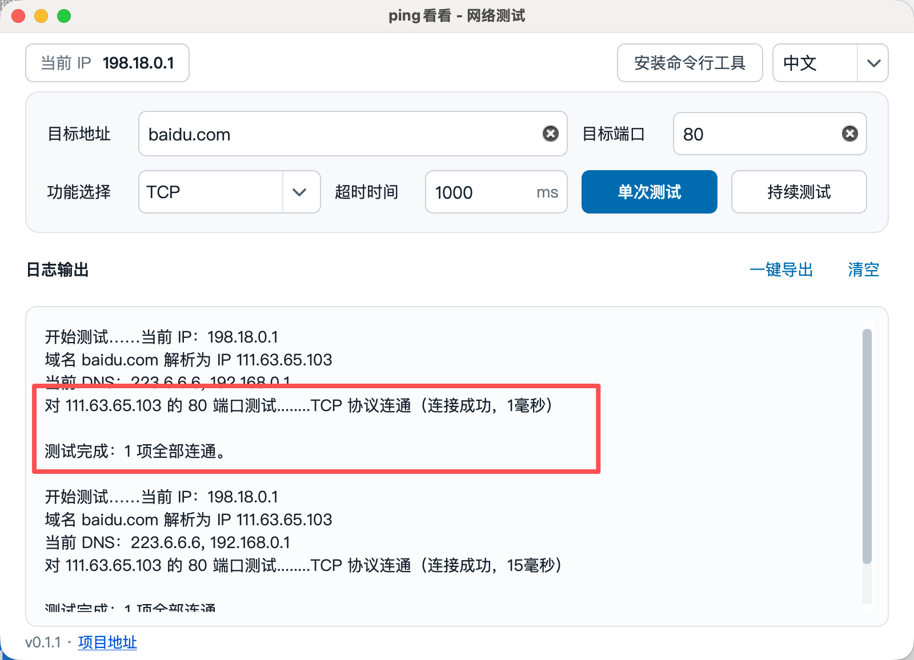
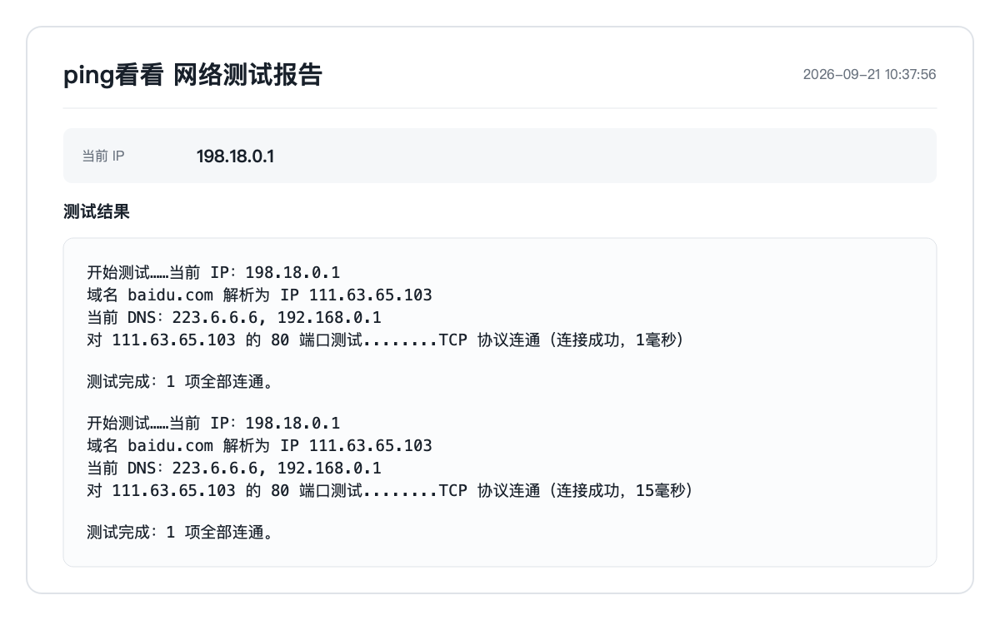

# ping看看（pingkk）

适合专业人士和非专业人士的网络检测工具。运维人员可以将它发给办公人员，用于自行排查网络问题并直接导出测试结果。

支持多平台，兼有图形界面和命令行；图形界面采用现代化设计，操作简单，并提供原生级中文支持。

支持：

- TCP、UDP 端口测试
- Ping 和路由追踪
- 一键网络检查：检查本机出口、默认网关、DNS、代理和 HTTPS 直连
- DNS 对比诊断：对比系统 DNS、当前 DNS、阿里 DNS 和腾讯 DNS
- 持续测试与自定义超时时间
- 可选高级输出：显示单包大小、丢包率、时延范围、波动及各检测功能的汇总统计
- 一键导出测试报告

## 界面预览





图形界面支持将当前测试结果导出为报告图片，方便保存或发送给他人。



## 下载

前往 [Releases](https://github.com/trah01/pingkk/releases) 下载适合你系统的版本。

仅使用命令行时，可直接[一键安装 CLI](#一键安装-cli)，自动选择系统和处理器架构。

**Windows 10 1809 及以上推荐下载 `pingkk-windows-x64-portable.exe`。** Windows 7、Server 2008 R2 和 Server 2016 等旧系统使用 `pingkk-windows-x64-legacy-portable.exe`；ARM 设备使用 `pingkk-windows-arm64-portable.exe`。单文件版双击即可使用，运行时会自动释放依赖到临时目录，正常关闭后清理。

按系统和处理器架构选择下载包，具体文件以对应 Release 的附件为准：

| 系统 | 处理器架构 | 图形界面便携包 / 应用包 | 安装包 | 命令行（CLI）包 | 文件名前缀 |
| --- | --- | --- | --- | --- | --- |
| Windows | x64（Windows 10 1809 及以上） | `portable.exe`（单文件） | `setup.exe` | `cli.zip` | `pingkk-windows-x64-` |
| Windows | x64（旧系统兼容版） | `portable.exe`（单文件） | `setup.exe` | `cli.zip` | `pingkk-windows-x64-legacy-` |
| Windows | ARM64 | `portable.exe`（单文件） | `setup.exe` | `cli.zip` | `pingkk-windows-arm64-` |
| macOS | Intel（x86_64） | `gui.zip`（含 `.app`） | — | `cli.zip` | `pingkk-macos-intel-` |
| macOS | Apple Silicon（ARM64） | `gui.zip`（含 `.app`） | — | `cli.zip` | `pingkk-macos-arm64-` |
| Linux | x86（32 位） | `portable.tar.xz` | `installer.deb` | `cli.tar.gz` | `pingkk-linux-x86-` |
| Linux | x64（含麒麟 / 统信 x64） | `portable.tar.xz` | `installer.deb` | `cli.tar.gz` | `pingkk-linux-x64-` |
| Linux | ARM64（含麒麟 / 统信 ARM64） | `portable.tar.xz` | `installer.deb` | `cli.tar.gz` | `pingkk-linux-arm64-` |

文件名前缀加上包名即为完整下载文件名，例如 Windows x64 单文件版为 `pingkk-windows-x64-portable.exe`。表中的“—”表示不提供该类型的包。

- **安装包**：Windows 使用 `setup.exe`；Linux 使用 `sudo apt install ./文件名.deb`，由系统安装所需 Qt 运行库，包内不重复携带。首次安装依赖可能需要联网。
- **便携包 / 应用包**：Windows 的 `portable.exe` 直接双击；macOS 解压后打开 `pingkk.app`；Linux 解压后运行 `run-pingkk.sh`。
- **CLI 包**：仅使用命令行时选择。图形界面包也已内置命令行程序，无需重复下载。

Windows 不再提供 x86 / XP 版本。

### 一键安装 CLI

在终端执行对应命令，安装最新版本的命令行工具：

macOS / Linux：

```bash
curl -fsSL https://he.sb/pingkk.sh | sh
```

默认安装到 `/usr/local/bin/pingkk`，需要时会通过 `sudo` 请求管理员权限。macOS 自动选择 Intel / Apple Silicon，Linux 支持 x86 / x64 / ARM64，需要 glibc 2.28 及以上；不支持 Alpine / musl。脚本需要系统提供 `curl`、解压工具和 SHA256 工具。

Windows（在 PowerShell 5.1 或更高版本中执行）：

```powershell
irm https://he.sb/pingkk.ps1 | iex
```

安装到当前用户的 `%LOCALAPPDATA%\Programs\pingkk`，自动加入用户 PATH，无需管理员权限。自动选择 x64、旧系统 x64 兼容版或 ARM64。

两个脚本均直接从 `https://he.sb/pingkk/latest/` 下载 CLI 包及 `SHA256SUMS.txt`，不访问 GitHub，并在安装前校验 SHA256；再次执行即可更新到网站提供的最新版本。安装后运行 `pingkk --help`。

macOS / Linux 也可安装到已有的用户目录，例如：

```bash
mkdir -p "$HOME/.local"
curl -fsSL https://he.sb/pingkk.sh | PINGKK_PREFIX="$HOME/.local" sh
```

使用自定义目录时，需要将其 `bin` 子目录加入 PATH。

### 兼容性基线

构建优先兼容旧系统，Qt 主版本和工具链按平台固定，不自动升级：

| 平台 | 构建基线 |
| --- | --- |
| Windows x64 现代版 | Qt 6.8.3、MSVC 2022 v143；Windows 10 1809 及以上 |
| Windows x64 兼容版 | Qt 5.15.2、MSVC 2019 v142；面向 Windows 7 SP1 / Server 2008 R2 SP1 及以上，包括 Server 2016。旧系统须安装所需系统更新和 Universal CRT |
| Windows ARM64 | Qt 6.8.3 官方 ARM64 构建，Windows 10 1809 及以上；Qt 5.15 无对应官方原生 ARM64 包 |
| macOS Intel | Qt 5.15.2，macOS 10.13 及以上 |
| macOS Apple Silicon | Qt 6.2.4，macOS 11 及以上 |
| Linux x86 / x64 / ARM64 | Debian 10、glibc 2.28、Qt 5.11；需要 X11 或 XWayland，DEB 的具体依赖以包内声明为准 |

上述是构建目标，不代表已在每一种旧系统上实测。GitHub Actions 进行打包后启动检查，并检查 Windows x64 已知不兼容入口及 macOS 所有内置库的最低系统版本；托管 Runner 不提供 Server 2016，仍需在该系统验收。

Windows 单文件版也支持 `程序.exe --extract 新目录`，用于保留解压文件或替换 Qt 动态库；随后可直接运行目录内的 `pingkk-gui.exe`。目标目录必须尚不存在。

### macOS 打开方式

macOS 版本不使用 Apple Developer ID 和公证。解压后若系统提示无法验证应用，请打开“终端”，进入 `pingkk.app` 所在目录并执行：

```bash
xattr -dr com.apple.quarantine pingkk.app
```

然后再双击打开 `pingkk.app`。该命令只会清除此应用的下载隔离标记。

## 命令行用法

图形界面右上角选择 `English` 后，后续测试的日志、诊断信息及报告使用英文。命令行默认使用中文，可添加 `--lang en` 切换英文，例如 `pingkk example.com 443 --lang en` 或 `pingkk --help --lang en`；使用 `--lang zh` 切回中文。

运行 `pingkk gui` 打开已安装的图形界面；未找到时会提示前往 GitHub Releases 或 `https://he.sb/pingkk/` 下载图形界面包或安装包。

运行 `pingkk update` 升级当前 CLI。默认检查 GitHub 最新正式 Release，连接探测（含重定向）的总超时为 1000ms；超时、连接失败或附件下载失败时，自动切换到 `https://he.sb/pingkk/latest/`。下载文件会进行 SHA256 校验，并确认新程序能够运行；校验失败不替换当前程序，下载源版本较旧时不降级。可用 `pingkk --version` 查看当前版本，用 `pingkk update --lang en` 查看英文更新提示。

更新会替换当前 CLI 的实际文件路径，macOS / Linux 的系统目录可能需要 `sudo`，Windows 的系统目录需要管理员权限。macOS 应用包内的 CLI 需通过图形界面包整体更新，避免破坏应用签名。macOS / Linux 需要系统已有的 `curl`、解压及 SHA256 工具；Windows 需要 PowerShell 5.1 或更高版本。

```bash
# 测试 TCP 端口
pingkk example.com 443 tcp

# 测试 UDP 端口
pingkk example.com 53 udp

# 同时测试 TCP 和 UDP
pingkk example.com 53 all

# 测试多个端口
pingkk example.com 80,443 tcp

# 持续测试
pingkk -t example.com 443 tcp

# 默认使用 IPv4；使用 IPv6 或同时测试两种协议
pingkk example.com 443 -v6
pingkk example.com 443 -v46
pingkk example.com -v6
pingkk example.com --route -v6
pingkk example.com --dns -v46
pingkk -jc -v46

# Ping（默认 4 次）和路由追踪
pingkk example.com
pingkk example.com --route

# 一键网络检查与 DNS 对比
pingkk -jc
pingkk --checkup
pingkk --dns example.com
pingkk example.com --dns

# 输出更详细的诊断信息
pingkk --advanced example.com 443 tcp
pingkk -a --dns example.com
```

端口类型可使用 `tcp`、`udp` 或 `all`。地址、端口和协议支持调整顺序，例如 `pingkk 443 example.com tcp`；纯数字地址存在歧义时，第一个参数作为地址。选项 `-t`、`-r`/`--route`、`-a`/`--advanced`、`-jc`/`--checkup`、`--timeout`/`-w`、`--lang`、`-v6` 和 `-v46` 可放在命令中的任意位置；`--timeout` 和 `--lang` 的值需紧跟对应选项。高级输出默认关闭，只有指定 `-a` 或 `--advanced` 时才会显示单包大小、丢包率、时延范围、波动及对应功能的汇总统计。

```bash
# 自定义超时时间（毫秒）
pingkk --timeout 1000 example.com 443 tcp
```

默认只测试 IPv4；`-v6` 只测试 IPv6，`-v46` 分别测试 IPv4 和 IPv6，适用于端口、Ping、路由追踪、DNS 对比和网络检查。持续测试时轮流探测两种协议；某一种解析或连接失败会单独报告，不自动切换到另一种。图形界面可在顶部选择 `IPv4`、`IPv6` 或 `IPv4 + IPv6`。IPv6 网络检查显示前缀长度，不使用 IPv4 子网掩码。

UDP 端口只有在收到目标响应时才会显示为连通；没有响应时显示“状态未知”。

## 许可证

本项目采用 [GNU LGPL v3.0](licenses/LGPL-3.0.txt) 许可证。
